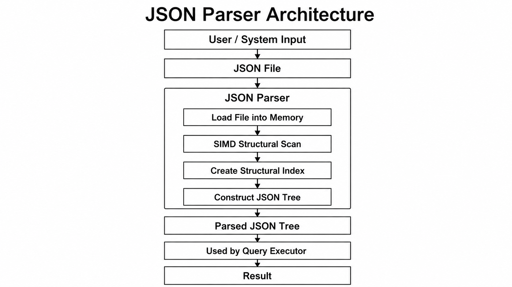

# System Design

## 1. System Architecture

### JSON Parser Architecture

## 2. Inferences of Modules

### Module Relations

The JSON Parser reads the input file once and produces an in-memory representation of the data.

The Indexer consumes that representation and builds lookup structures so the Query Executor doesn't have to re-scan the whole document per query.

The Query Parser independently parses the query string (dot-path or `GET...FROM...WHERE` syntax) into a small AST (Abstract Syntax Tree).

The Query Executor takes the parsed query (AST) and the index, and produces the final result.

This separation means parsing the JSON and parsing the query are decoupled, so we can optimize each independently, and we can run many queries against one parsed/indexed file without re-parsing the JSON each time.

### Module Descriptions

#### JSON Parser

**Responsibility:** Convert raw JSON/JSONL text into an internal tree/array representation.

**Key design decision:** Parse once, reuse across multiple queries, rather than re-parsing per query.

#### Indexer

**Responsibility:** Build a structure that maps paths/keys to their locations in the parsed data, so lookups don't require re-traversing the full tree.

**Key design decision:** Trade a one-time indexing cost for much faster repeated queries — this is where a lot of our optimization work will happen (Sprint 2).

#### Query Parser

**Responsibility:** Parse the supported query forms. Supports dot-path with `[*]` (wildcard), and Filter queries with `GET...FROM...WHERE`, as well as `AND` into a simple AST the executor can walk.

#### Query Executor

**Responsibility:** Walk the AST against the index to resolve the query and return results in the format defined in our query spec.
